# MyForrest – Wald im Wandel

**Street View für die Natur, über die Zeit.**

Beim Joggen, Wandern oder Biken fallen immer wieder Sturmschäden, Borkenkäfernester, neue
Lichtungen oder sich ausbreitende Neophyten auf. MyForrest sammelt Fotos solcher Orte und legt
sie zeitlich übereinander. So wird sichtbar, wie sich der Wald an einem Ort über Monate und Jahre
verändert. Dasselbe geht für Gletscher und Gebirge: wie weit das Eis früher reichte, wann es einen Ort
freigab und wie früh der Schnee heute schmilzt.

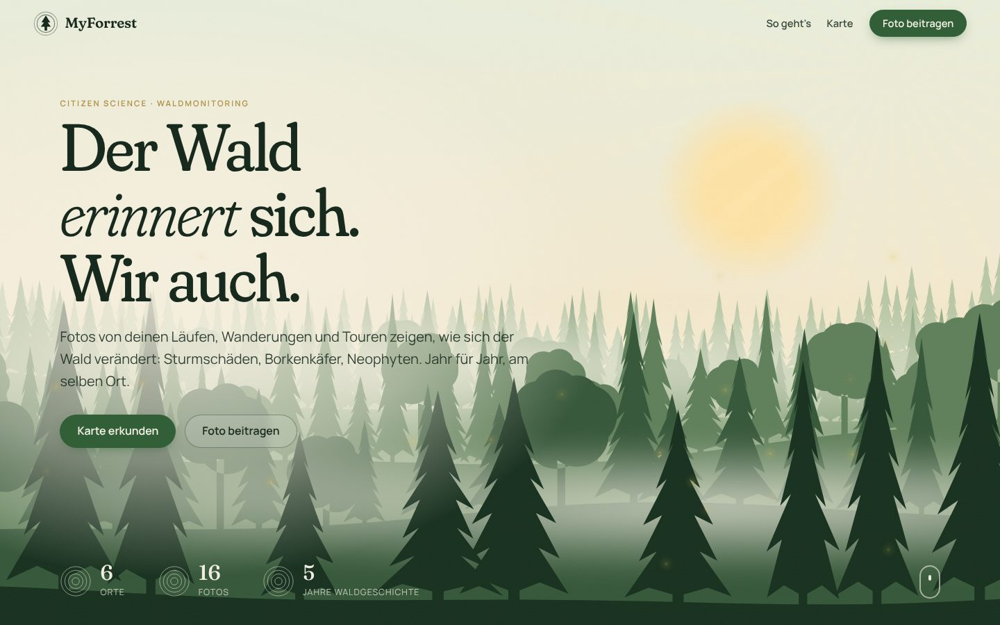

Die Startseite wechselt alle acht Sekunden zwischen Wald, Gletscher, Gebirge und Wüste, jede Landschaft mit
eigener gezeichneter Szene, Farbstimmung und Überschrift; die Knöpfe unter der Überschrift halten eine fest.

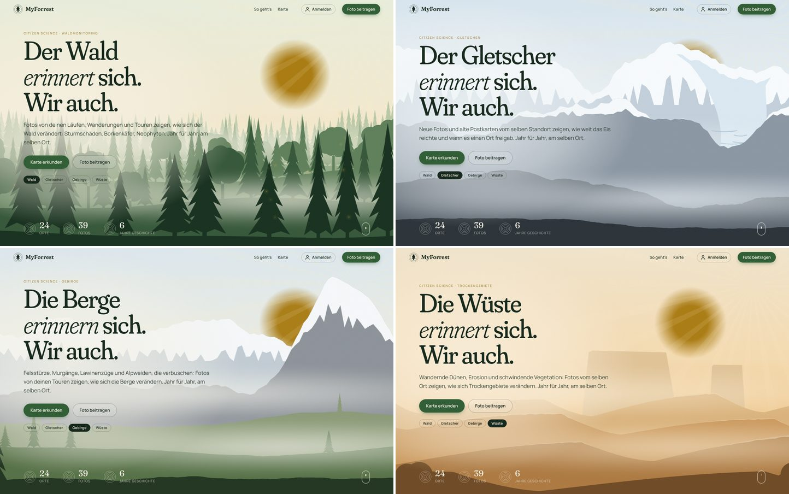

## Die App im Überblick

Die Idee ist einfach: Wer regelmässig dieselben Wege läuft, kommt immer wieder an denselben Stellen
vorbei. Ein Foto pro Besuch genügt. MyForrest ordnet die Fotos einem Ort zu, richtet sie
deckungsgleich aus und zeigt, was sich verändert hat. So entsteht für jeden Ort eine Zeitreihe, ähnlich
wie bei Street View, nur mit der Zeit als zusätzlicher Achse.

Der Ablauf hat drei Schritte:

1. **Unterwegs fotografieren**: Ein Handyfoto mit GPS oder eine Action-Cam im Intervallmodus mit
   GPX-Track von Uhr, Strava oder Komoot. Die App findet den Ort automatisch.
2. **Am selben Ort wiederkommen**: Beim nächsten Besuch liegt das alte Foto als Overlay über dem
   Kamerabild, damit derselbe Ausschnitt gelingt.
3. **Veränderung sichtbar machen**: Die Fotos werden automatisch ausgerichtet. Zeitraffer,
   Vorher/Nachher-Regler und Heatmap zeigen, was passiert ist.

> Die Screenshots zeigen generierte Demo-Bilder eines fiktiven Waldstücks bei Zürich, eine vereinfachte
> Platzhalter-Karte und synthetische Wetter- und Satellitendaten. Im Betrieb zeigt die App echte Fotos,
> OpenStreetMap- bzw. swisstopo-Kacheln und Daten von Open-Meteo, Sentinel-2 und Landsat. Wie die Bilder
> entstehen, steht unter [`scripts/screenshots`](scripts/screenshots/README.md). Auch Gletscher und Alpweide in
> Abschnitt 14 sind erfunden.

### 1. Karte mit Spots

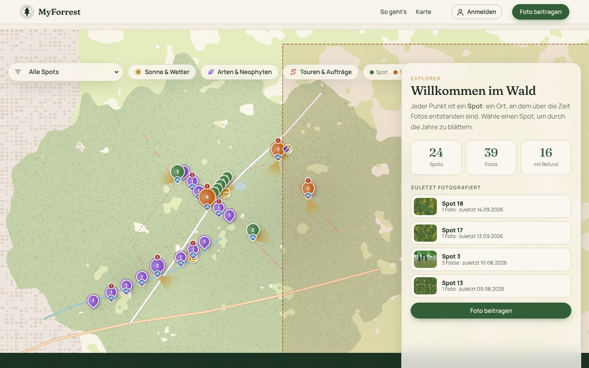

Jeder Marker ist ein **Spot**, also ein Ort, an dem über die Zeit Fotos entstanden sind. Fotos, die
weniger als 25 m auseinander liegen und in dieselbe Richtung blicken (±45°), landen automatisch im
selben Spot. Ein goldener Sichtkegel am Marker zeigt die Blickrichtung. Die Zahl im Marker nennt die
Anzahl Fotos, die Farbe den Befund: grün für unauffällig, orange für Schäden (Sturm, Borkenkäfer,
Trockenschaden, Holzschlag, frühe Laubverfärbung, Frost) und violett für Neophyten. Kleine Zeichen am
Marker melden:
- **Rotes Ausrufezeichen:** Auffälligkeiten im Wetter, etwa Trockenheit oder Hitze vor der Aufnahme.
- **Blaues Windsymbol:** Einen Sturm seit dem letzten Besuch.
- **Violetter Satellit:** Einen Rückgang im Satellitenbild, auch ohne neues Foto.

Beim Überfahren eines Markers fasst ein Tooltip alles zusammen: Veränderung, Wetter, Sturm, Satellit,
Baumarten und Blickrichtung. Schraffierte Quadrate stehen für geschützte Funde (Abschnitt 11).

<p>
  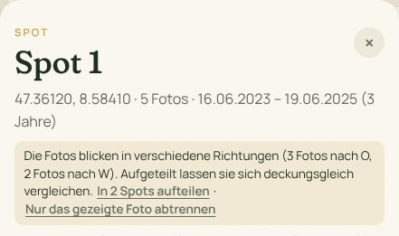
  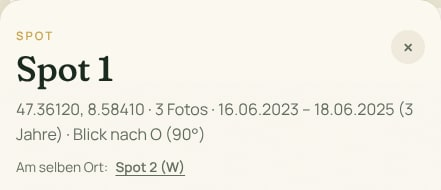
</p>

Ältere Spots (oder Fotos ohne Kompass) können Fotos in verschiedene Richtungen mischen. Dann bietet der
Spot an, sich **aufzuteilen**: ein Spot pro Blickrichtung, jeder für sich ausgerichtet und verglichen,
oder nur das gezeigte Foto abzutrennen.
Oben links lässt sich die Karte nach Beobachtungen und Meldungen filtern,
daneben schalten *Sonne & Wetter*, *Arten & Neophyten* und *Touren & Aufträge* die Kartenmodi ein
(Abschnitte 7, 8 und 10), mit Gletscherinventaren auch *Gletscher* (Abschnitt 14). Gelbe Kamera-Pins sind Fotoaufträge.
Rechts stehen Kennzahlen und die zuletzt fotografierten Spots.

### 2. Zeitreise an einem Spot

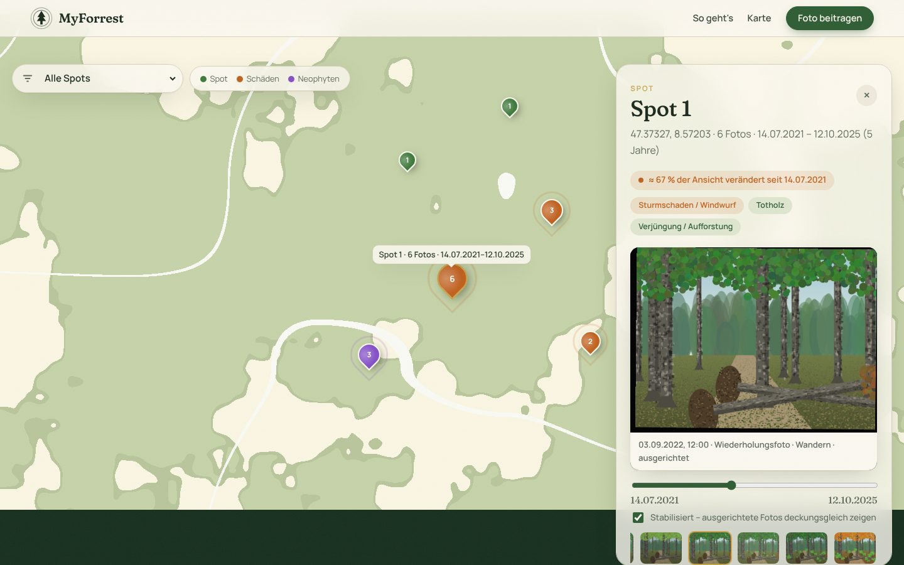

Ein Klick auf einen Spot öffnet seine Geschichte: Koordinaten, Zeitraum und Blickrichtung, dazu Höhe,
Hangneigung, Exposition und Geländeform aus dem Höhenmodell und die erwartete Herbstfärbung an diesem Ort.
Darunter folgen der Anteil der Ansicht, der sich seit dem ersten Foto verändert hat, alle Beobachtungen
und die Baumarten am Spot. Mit dem Zeitregler oder den Vorschaubildern blättert man durch die Aufnahmen.
Ist *Stabilisiert* aktiv, liegen alle Fotos deckungsgleich übereinander, auch wenn sie bei jedem Besuch
etwas anders aufgenommen wurden. Das Ergebnis wirkt wie ein Zeitraffer:

<p align="center">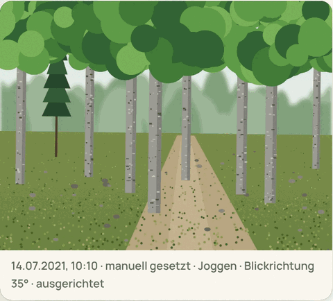</p>

Im Beispiel: Sommer 2021 noch intakt, im Februar 2022 wirft ein Sturm drei Buchen um, ab 2023 wachsen
in der Lücke junge Bäume nach, und im Frühling 2026 schliesst der Jungwuchs die Lücke.

Unter dem Bild lassen sich pro Foto Beobachtungen taggen und eine Notiz erfassen. Jedes Foto nennt
Urheber und Lizenz und lässt sich melden. Mit einem Pl@ntNet-Key bestimmt *Art bestimmen* die Pflanzen
auf dem Foto und erkennt invasive Neophyten.

### 3. Vorher / Nachher mit Veränderungs-Heatmap

<p>
  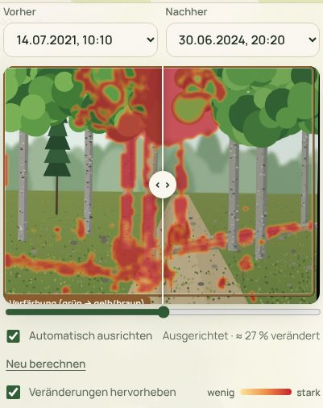
  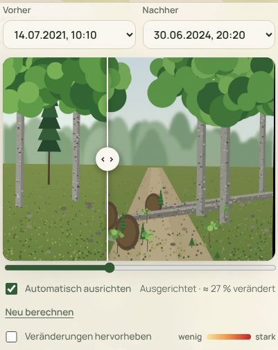
</p>

*Vorher / Nachher vergleichen* legt zwei beliebige Aufnahmen übereinander. Mit dem Wischregler
schiebt man die Grenze zwischen den beiden Bildern hin und her. *Automatisch ausrichten* korrigiert
Unterschiede in Standort, Zoom und Neigung. *Veränderungen hervorheben* blendet eine Heatmap ein
(gelb = wenig, rot = stark) und nennt den Anteil der veränderten Bildfläche. Unterschiede im Licht werden
dabei ausgeglichen, hier etwa das Abendlicht im Juni 2024 gegenüber dem Vormittag 2021. Die veränderten
Regionen werden eingeordnet (Windwurf, Auflichtung, Verfärbung, neuer Bewuchs); bestätigt oder korrigiert
man die Einordnung, lernt die App daraus.

<p align="center">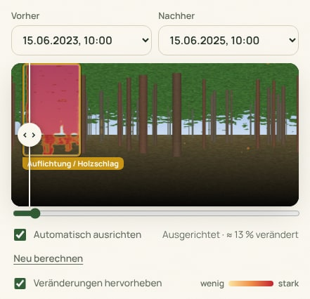</p>

Das geht auch mit **360°-Panoramen**, aus Videos wie aus Fotos von 360°-Kameras. Statt einer Homographie
sucht die App die Drehung der Kamera zwischen zwei Besuchen und dreht das spätere Panorama in die
Blickrichtung des früheren; der Bereich unten, wo die Person mit der Kamera steht, zählt nicht. Hier wurde
die Kamera 2025 um 70° anders gehalten, und die Heatmap markiert die neue Lücke im Bestand
(Demo-Panoramen, gerechnet).

### 4. Wiederholungsfoto mit Overlay

<p>
  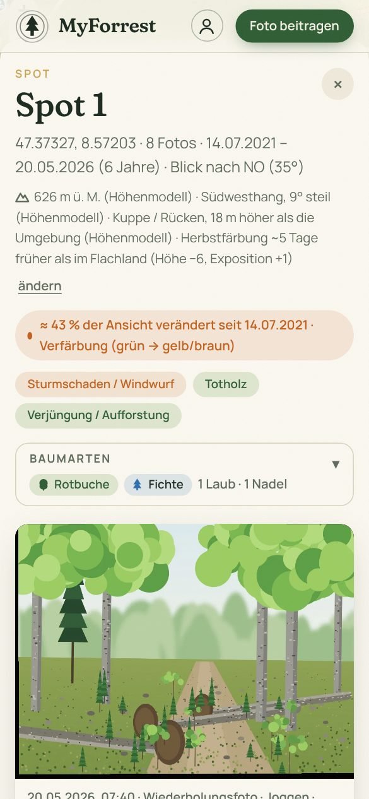
  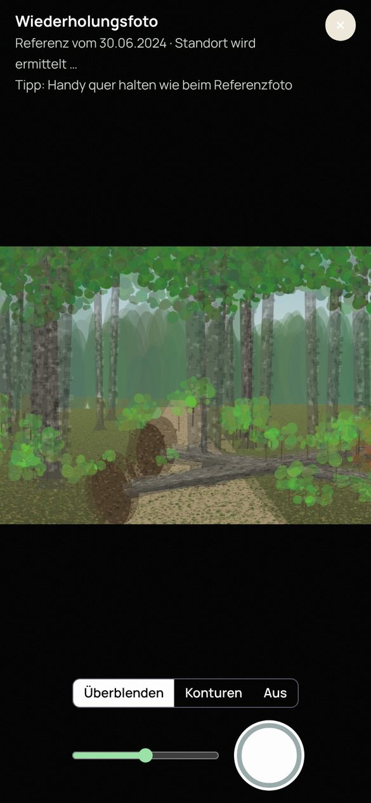
  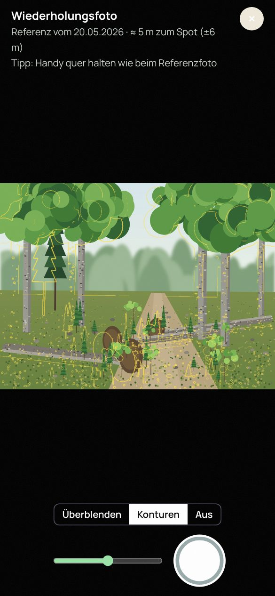
</p>

Auf dem Handy öffnet *Wiederholungsfoto aufnehmen* die Kamera. Das aktuell gewählte Foto dient als
Referenz und liegt entweder halbtransparent (*Überblenden*) oder als gelbe Linien (*Konturen*) über dem
Livebild. Man bewegt sich, bis Bild und Overlay übereinstimmen, und löst aus. Oben stehen die Entfernung
zum Spot samt GPS-Genauigkeit und, falls nötig, der Hinweis, das Handy wie beim Referenzfoto zu drehen. Das
neue Foto gehört automatisch zu diesem Spot und öffnet sich gleich im Vorher/Nachher-Vergleich.

### 5. Fotos und Videos hochladen

<p align="center">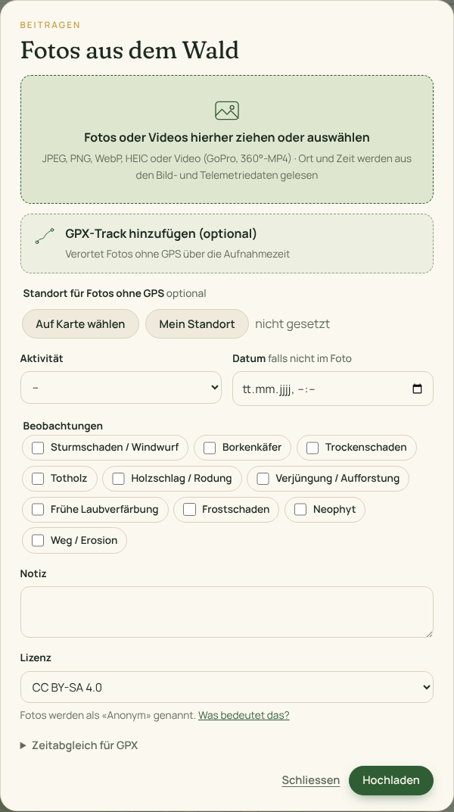</p>

*Foto beitragen* nimmt beliebig viele Fotos auf einmal entgegen, auch HEIC vom iPhone und Videos von GoPro,
Dashcams (GPS direkt aus der Datei: NMEA, Novatek) oder 360°-Kameras, aus denen entlang der Route Einzelbilder
werden. Ort und Zeit kommen aus den EXIF- bzw.
Telemetriedaten. Fotos ohne GPS lassen sich über einen GPX-Track verorten (dafür gibt es unter
*Zeitabgleich für GPX* Zeitzone und Korrektur für die Kamera-Uhr) oder von Hand auf der Karte bzw. über
den aktuellen Standort. Dazu kommen Aktivität, Landschaft (Wald, Gletscher, Gebirge, Trockengebiet oder
automatisch erkannt; sie
bestimmt, welche Beobachtungen zur Wahl stehen), Beobachtungen, eine Notiz und die Lizenz (Standard
CC BY-SA 4.0). Als installierte App landen Uploads ohne Empfang in einer Warteschlange und gehen später raus;
lehnt der Server einen davon ab, während die App zu ist, meldet das eine Benachrichtigung.

<p align="center">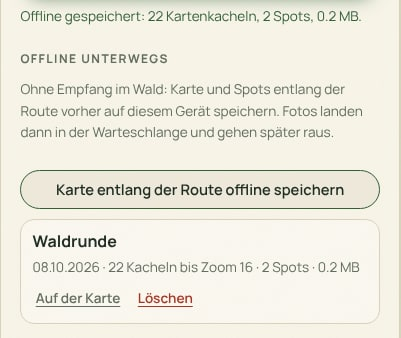</p>

<p align="center">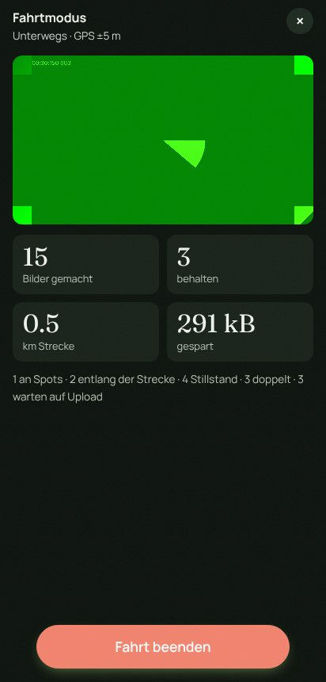</p>

Im Auto wird das Handy zur **Dashcam**: Der *Fahrtmodus* (unter *Touren & Aufträge* oder als Verknüpfung der
installierten App) macht alle paar Sekunden ein Bild und zeichnet die Strecke als Tour auf. Behalten werden
nur Bilder an bekannten Spots (das nächstgelegene, in Blickrichtung des Spots) und eines alle 150 m; Bilder
im Stillstand, unscharfe und solche, die gleich aussehen wie das letzte, verwirft schon das Handy. Aus
einem Tag mit Tausenden Bildern werden so einige Dutzend, die im Hintergrund hochgeladen werden. (Im
Screenshot liefert die Testkamera des Browsers das Bild.) In der Zeitreise tragen Bilder aus dem Auto die Marke
*Fahrt* und lassen sich ausblenden.

<p align="center">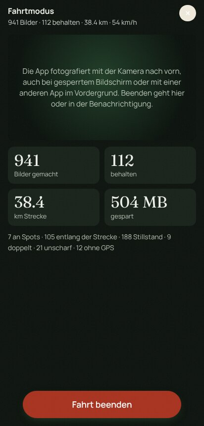</p>

Browser halten Kamera und GPS an, sobald der Bildschirm aus ist. Die **[Android-App](docs/android.md)** zeigt
dieselbe Web-App und lässt Fahrtmodus und Tour-Aufzeichnung im Hintergrund weiterlaufen, auch mit gesperrtem
Bildschirm oder mit der Navigation im Vordergrund. Die Auswahl der Bilder trifft dann die App selbst, nach
denselben Regeln (und Testfällen) wie im Browser; beenden lässt sich die Fahrt auch in der Benachrichtigung.
Die neueste Version liegt immer unter
**[Releases → myforrest.apk](https://github.com/michifrey/myforrest/releases/latest/download/myforrest.apk)**.

Vor einer Tour ohne Empfang speichert *Touren & Aufträge → Karte entlang der Route offline speichern* die
Kartenkacheln eines Korridors um die Route und die Spots daran (mit Vorschaubildern und den Referenzfotos
für das Kamera-Overlay) auf dem Gerät. Unterwegs zeigt die App Karte und Spots dann auch ohne Netz.

### 6. Wetter, Stürme und Satellit

<p>
  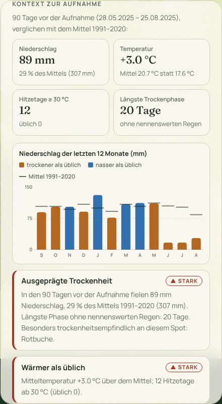
  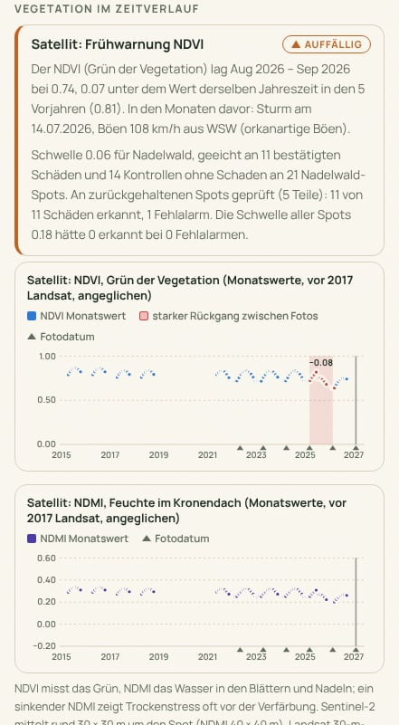
</p>

*Kontext zur Aufnahme* vergleicht die 90 Tage vor jedem Foto mit dem Mittel 1991–2020: Niederschlag,
Temperatur, Hitzetage, längste Trockenphase und die Niederschläge der letzten zwölf Monate. Daraus
entstehen Hinweise wie *Ausgeprägte Trockenheit*, *Frühe Laubverfärbung*, *Erhöhtes Borkenkäfer-Risiko*
oder *Windwurf nach Sturm*, abgestimmt auf die Baumarten am Spot. Im Beispiel links färben die Buchen
schon Ende August, nach einem Sommer mit 29 % des üblichen Regens.

*Vegetation im Zeitverlauf* (rechts) zeigt den Grünanteil aus den Fotos und den NDVI und Feuchteindex
NDMI aus Sentinel-2, vor 2017 aus Landsat, an Sentinel-2 angeglichen. Fällt ein Index an einem Spot ohne neues Foto deutlich unter
die Werte derselben Jahreszeit in den Vorjahren, meldet die **Frühwarnung**, dass sich ein Besuch lohnt;
fällt er zwischen zwei Fotos, markiert das Diagramm den Zeitraum. Die Schwellen für beides eichen sich an
bestätigten Schäden, getrennt für Laub- und Nadelwald. Hier: ein Fichten-Tannen-Bestand mit Borkenkäfer.
Sein NDVI sank nur um 0,07–0,08; die Nadelwald-Schwelle 0,06 erkennt das, die Schwelle aller Spots (0,18)
hätte an Nadelwald-Spots keinen der bestätigten Schäden gefunden.

<p align="center">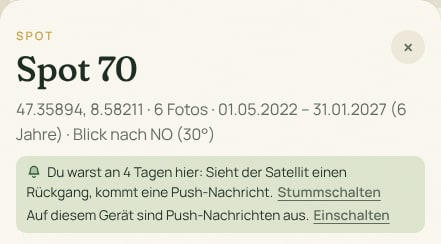</p>

Wer einen Spot regelmässig besucht (an mindestens zwei Tagen fotografiert) oder ihm folgt, bekommt neue
Frühwarnungen als **Push-Nachricht** aufs Handy; ein Tipp darauf öffnet den Spot. Eingeschaltet wird das
einmal pro Gerät im Kontomenü, stummschalten lässt es sich pro Spot.

### 7. Sonne & Wetter auf der Karte

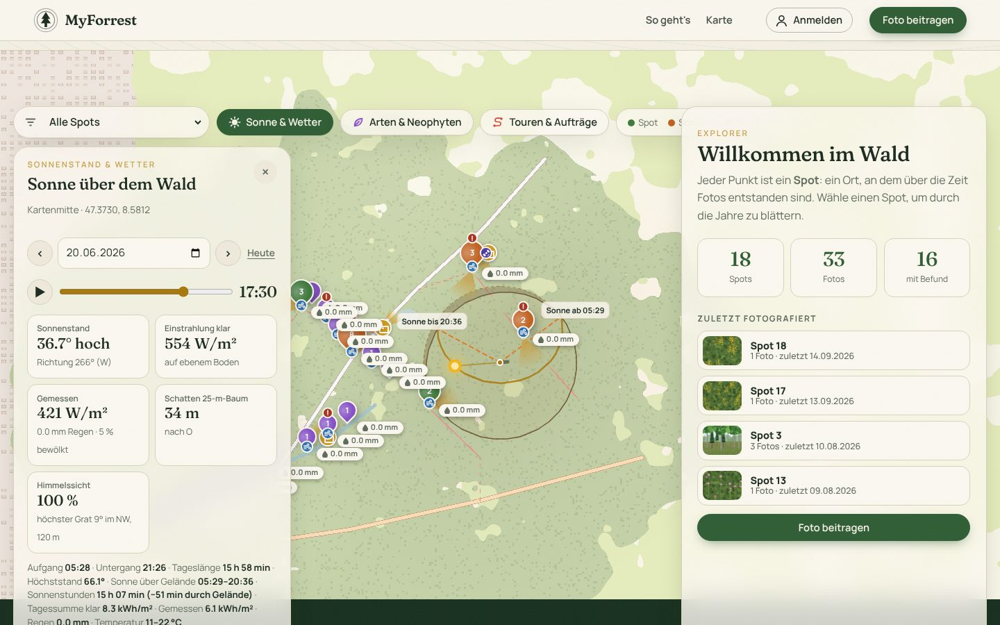

Der Kartenmodus *Sonne & Wetter* zeigt für ein beliebiges Datum und eine Uhrzeit die Sonnenbahn, den
Sonnenstand, den Schatten eines 25-m-Baums und die Richtung von Auf- und Untergang. Der Geländehorizont aus
dem Höhenmodell blockiert die Sonne hinter Hügeln (*Sonne ab 05:29*, *Sonne bis 20:36*). Das Panel nennt
Sonnenhöhe, Einstrahlung bei klarem Himmel und gemessen, Himmelssicht, Sonnenstunden und Regen. An jedem
Spot steht die Regenmenge des Tages. *Kühle Abschnitte aus Touren* legt eine Karte darüber, wo es kühler oder
wärmer ist, aus den Temperaturen, die Läuferinnen und Läufer mit ihren Touren anonym teilen (bereinigt um
Wetter, Tageszeit und Körperwärme, erst ab drei Touren von zwei Personen pro 100-m-Zelle).

### 8. Arten & Neophyten

<p>
  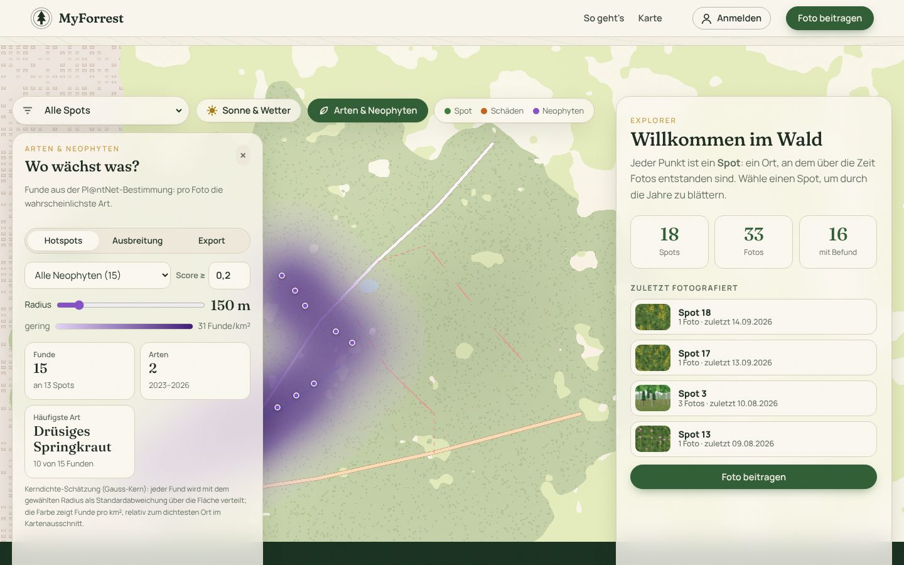
  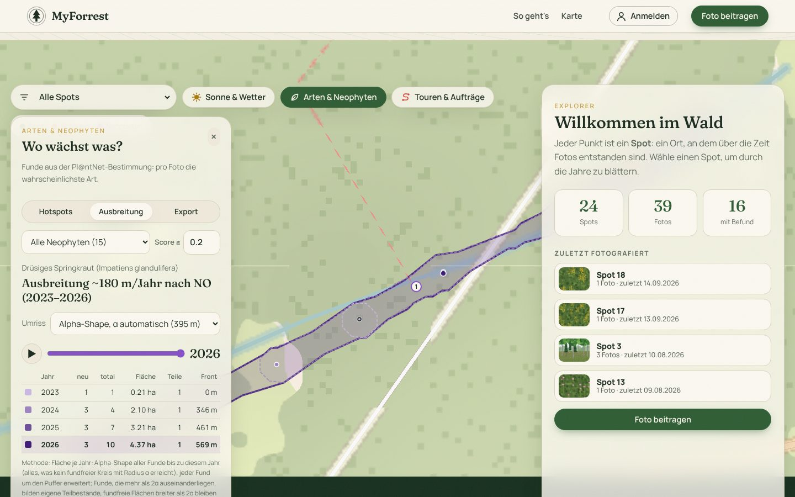
</p>

*Arten & Neophyten* wertet die Pflanzenbestimmungen als Funde aus. **Hotspots** (links) zeigen als
Kerndichte-Karte, wo sich Funde aller Neophyten, aller Arten oder einer Art häufen. **Ausbreitung** (rechts)
zeichnet pro Art die besiedelte Fläche Jahr für Jahr, verfolgt einzelne Teilbestände und schätzt Tempo und
Richtung, im Beispiel das Drüsige Springkraut entlang eines Bachs mit ~180 m pro Jahr. Unter *Export*
gehen die Funde als Darwin-Core-CSV an Info Flora und GBIF oder als CSV an iNaturalist.

### 9. Vektorkarten für GIS und Geoportale

<p>
  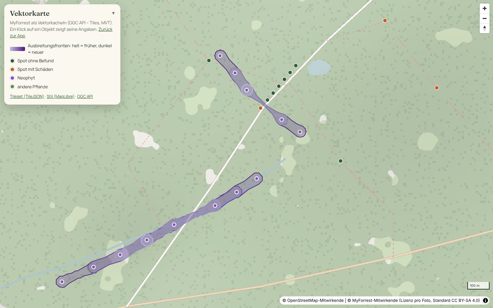
  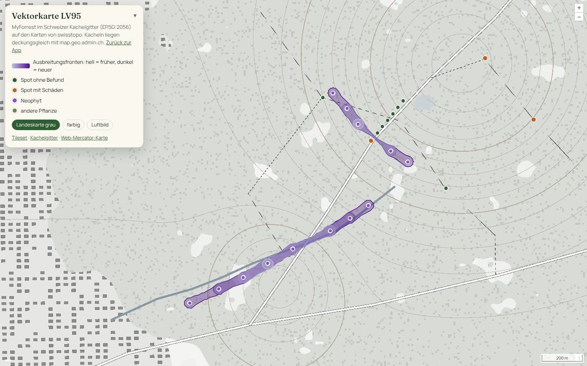
</p>

Alle Daten stehen auch als offene Geodienste bereit. `/vektorkarte.html` (links) zeigt Spots, Funde und
Ausbreitungsfronten als Vektorkacheln mit MapLibre in Web Mercator, `/vektorkarte-lv95.html` (rechts) mit
OpenLayers im Schweizer Kachelgitter LV95 auf der Landeskarte von swisstopo, deckungsgleich mit
map.geo.admin.ch. Ein Klick auf ein Objekt zeigt seine Angaben.

### 10. Touren und Fotoaufträge

<p>
  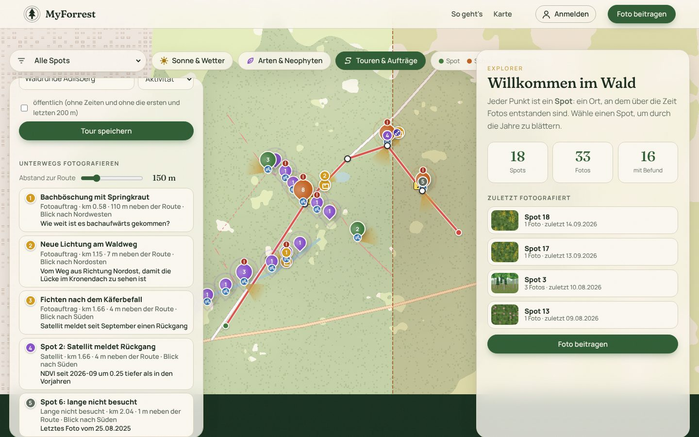
  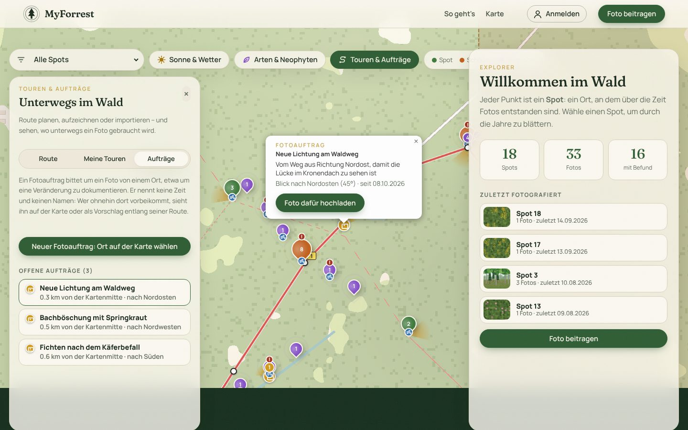
</p>

*Touren & Aufträge* hält fest, wo man unterwegs ist. Eine Route lässt sich auf der Karte **zeichnen**
(Klick für Klick; der Wege-Magnet zieht die Linie auf Wege und Pfade), mit dem Handy per GPS **aufzeichnen** oder als GPX, FIT
(Sportuhr, Velocomputer), TCX, KML oder GeoJSON **importieren**. Ein **Höhenprofil** zeigt Auf- und Abstieg; aus
FIT-, GPX- und TCX-Dateien fasst das Panel auch Puls, Leistung, Schrittfrequenz, Temperatur und die Developer-Felder
von Zusatzsensoren zusammen; das Profil zeigt sie auch entlang der Strecke und färbt die Route danach ein, etwa
wo es im Wald kühler war (nur für einen selbst sichtbar). Gelbe Kilometer-Marken zeigen den Verlauf, jede Route geht auch als GPX
wieder hinaus. Mit dem eigenen Routing-Server bevorzugt der Magnet Forststrassen und Rückegassen und führt
während der Schutzzeit um **Wildruhezonen** herum, die die Karte beim Planen zeigt, ebenso um **Holzerei**: Ein
Foto mit *Holzschlag* sperrt die Stelle sechs Wochen, der Forstdienst sperrt Wege mit Enddatum. Mit Konto lassen sich Touren speichern und veröffentlichen; andere sehen eine öffentliche
Tour ohne Zeiten und ohne die ersten und letzten 200 m. Über eine Tour mit Zeitstempeln lassen sich im
Upload auch Fotos ohne GPS verorten.

Ein **Fotoauftrag** (rechts) bittet um ein Foto von einem Ort, etwa «Neue Lichtung am Waldweg, Blick nach
Nordost», oder um ein neues Foto eines Spots. Er nennt keine Zeit und keinen Namen. Wer eine Route plant,
sieht unter *Unterwegs fotografieren* (links) in der Reihenfolge der Strecke, was nahe am Weg liegt: offene
Aufträge, Spots mit Satelliten-Frühwarnung und Fotoreihen, die seit über einem Jahr ruhen. Die Route wird
dafür nicht gespeichert. Ein Foto am richtigen Ort erledigt den Auftrag automatisch, und wer ihn gestellt hat,
bekommt eine Push-Nachricht. Aufträge gelten eine Woche bis ein Jahr (Standard drei Monate).

<p align="center">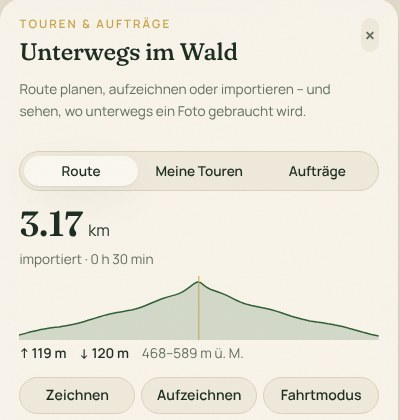</p>

### 11. Geschützte Funde für PRO-Mitglieder

<p>
  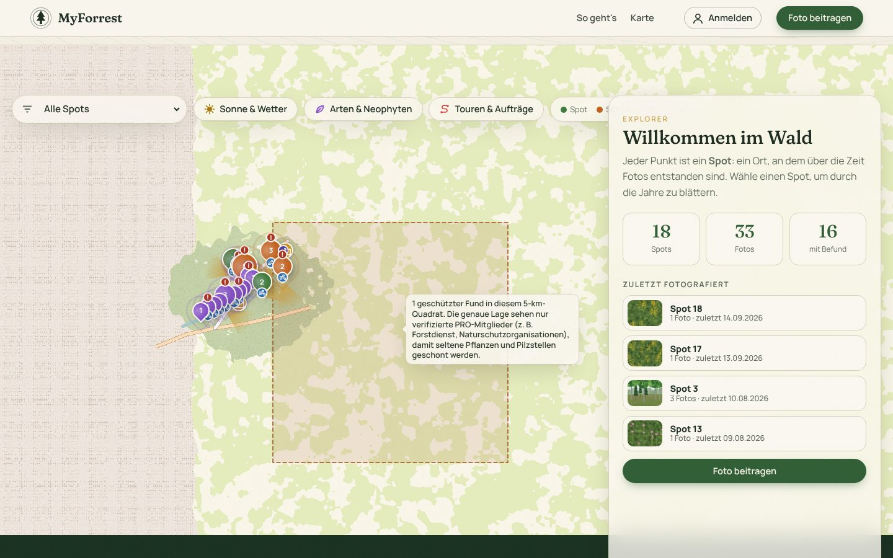
  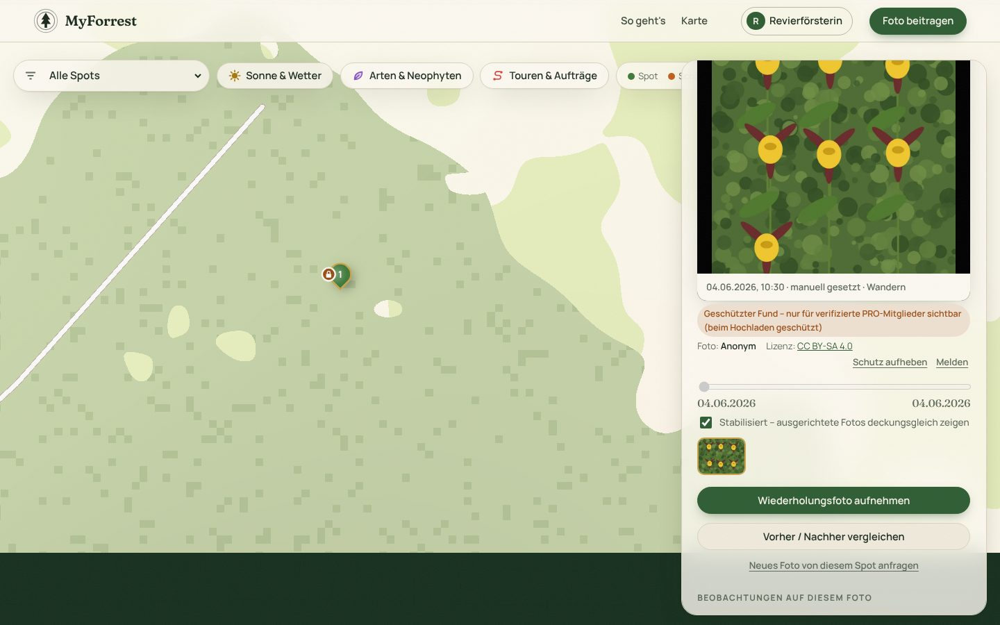
</p>

Seltene Pflanzen, Pilzstellen oder Horste sollen nicht geplündert oder zertrampelt werden. Ein Foto lässt
sich deshalb beim Hochladen als **geschützter Fund** markieren. Erkennt Pl@ntNet eine sensible Art, etwa
eine Orchidee oder einen Enzian, wird es automatisch geschützt. Die Öffentlichkeit sieht davon nur ein
schraffiertes **5-km-Quadrat** (links). Foto, Spot und genaue Lage sehen nur **verifizierte PRO-Mitglieder**
wie Forstdienste oder Naturschutzorganisationen (rechts, mit Schloss am Pin). PRO beantragt man im
Konto-Menü, eine Administratorin oder ein Administrator prüft den Antrag. Die Verifizierung gilt ein Jahr;
einen Monat vor dem Ablauf erinnert eine E-Mail daran, sie zu bestätigen. Geschützte Funde fehlen in allen
offenen Geodaten, Kacheln und Exporten für die Öffentlichkeit.

<p align="center">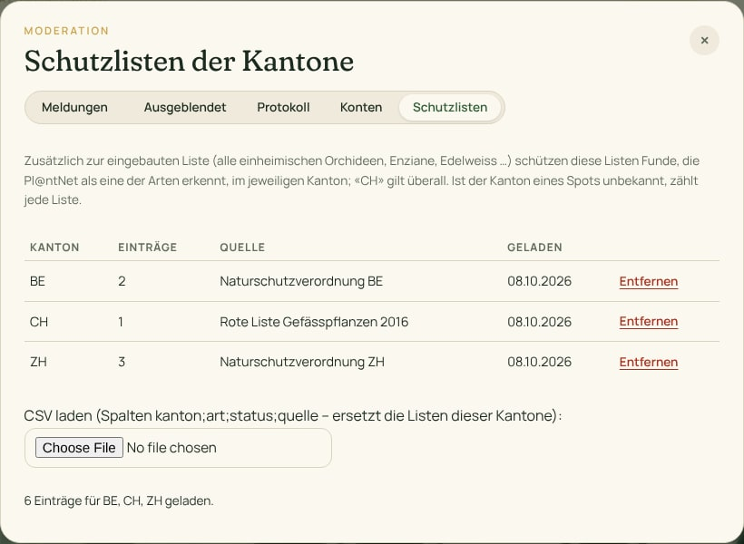</p>

Neben der eingebauten Liste laden Admins die **Schutzlisten der Kantone** (kantonale
Naturschutzverordnungen, Rote Liste) als CSV. Eine Art gilt dann dort als geschützt, wo der Spot liegt;
den Kanton fragt der Server einmal pro Spot bei geo.admin.ch ab. Funde, die schon vorher bestimmt wurden,
werden beim Laden einer Liste nachträglich geschützt.

<p align="center">
  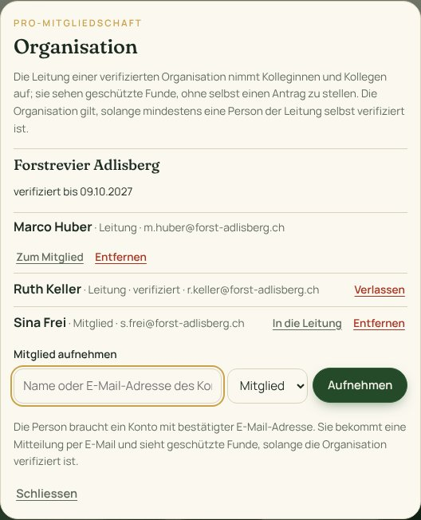
  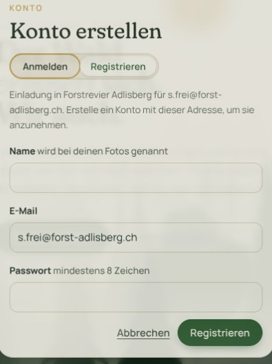
</p>

Ein Forstrevier oder eine Fachstelle muss nicht jede Person einzeln verifizieren lassen: Wer verifiziert ist,
leitet die **Organisation** und nimmt Kolleginnen und Kollegen auf; wer noch kein Konto hat, bekommt eine
**Einladung per E-Mail** und registriert sich über den Link. Mitglieder sehen geschützte Funde, solange eine
Person der Leitung verifiziert ist, und die Leitung lässt sich weitergeben.

### 12. Konto: E-Mail, Google, GitHub, Microsoft, SWITCH edu-ID oder AGOV

<p>
  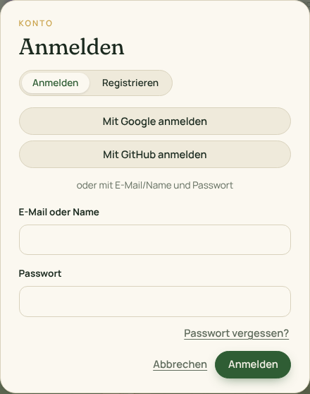
  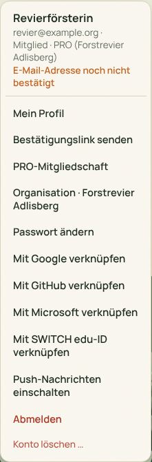
  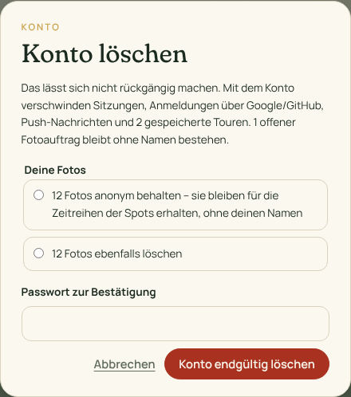
</p>

Ein **Konto** legt man mit E-Mail und Passwort an oder mit einem Klick über **Google**, **GitHub**, **Microsoft** oder **SWITCH edu-ID** (bei Behörden auch **AGOV**)
(links). Nach der Registrierung kommt ein **Bestätigungslink** per E-Mail; bis dahin erinnert das Konto-Menü
daran (Mitte). Ein vergessenes Passwort lässt sich per Link **zurücksetzen**, im Menü **ändern**, und
Google, GitHub, Microsoft oder SWITCH edu-ID lassen sich mit einem bestehenden Konto **verknüpfen**. Wer geht, **löscht das Konto**
selbst und entscheidet dabei, ob die eigenen Fotos anonym bleiben oder mitgelöscht werden (rechts). Uploads ohne Konto bleiben
möglich, ausser der Betrieb verlangt eines (`REQUIRE_LOGIN`) oder eine bestätigte Adresse
(`REQUIRE_VERIFIED_EMAIL`).

<p align="center">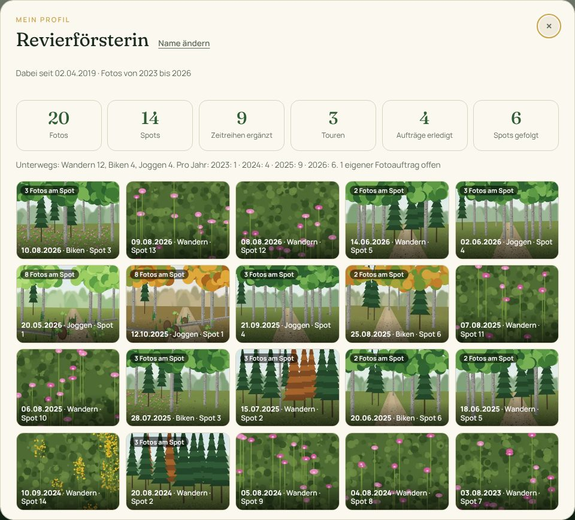</p>

Unter **Mein Profil** stehen die eigenen Beiträge: wie viele Fotos und Spots, wie viele Zeitreihen man
fortgesetzt und wie viele Fotoaufträge man erledigt hat, und alle eigenen Fotos, das neueste zuerst. Ein Klick
öffnet den Spot, und über *Name ändern* und *E-Mail ändern* lassen sich Anzeigename und Adresse anpassen (die neue Adresse gilt erst nach ihrem Bestätigungslink). *Meine Daten herunterladen* liefert alles zum Konto als ZIP: Fotos mit Originalen und GeoJSON, Touren als GPX (mit Sensorwerten), Aufträge und Meldungen. Das Profil sieht nur, wem es gehört; eine öffentliche Liste aller Fotos einer Person würde
zeigen, wo und wann sie regelmässig unterwegs ist.

### 13. Durchgehen wie Street View

<p align="center"></p>

*Durchgehen wie Street View* im Spot öffnet ein Bild bildschirmfüllend: 360°-Panoramen dreht man mit Finger
oder Maus, Pfeile unten führen weiter. Weisse Pfeile folgen der Aufnahme, also den Bildern eines 360°-Videos,
einer Fahrt oder eines Uploads mit mehreren Fotos. Goldene Pfeile führen zu anderen Spots in der Nähe. Die
Blickrichtung bleibt beim Schritt erhalten, *Zeit* wechselt zu einem anderen Jahr am selben Ort, und die
kleine Karte zeigt, wo man steht und wohin man schaut. Mit der Tastatur geht es mit W/S vor und zurück.
Einmal gesehene Bilder gehen auch ohne Empfang, im Wald und in den Bergen.

<p align="center">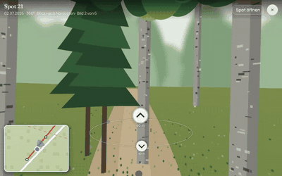</p>

Die Schritte gehen **weich**: Ein 360°-Bild dreht sich zuerst zum gewählten Pfeil, dann zoomt das alte Bild
in Gehrichtung und blendet aus, während das neue leicht herangezoomt ankommt; zurück zoomt es heraus, und ein
Wechsel der *Zeit* blendet nur über.

<p>
  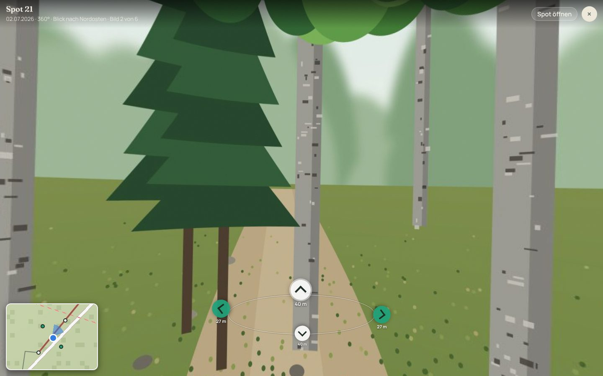
  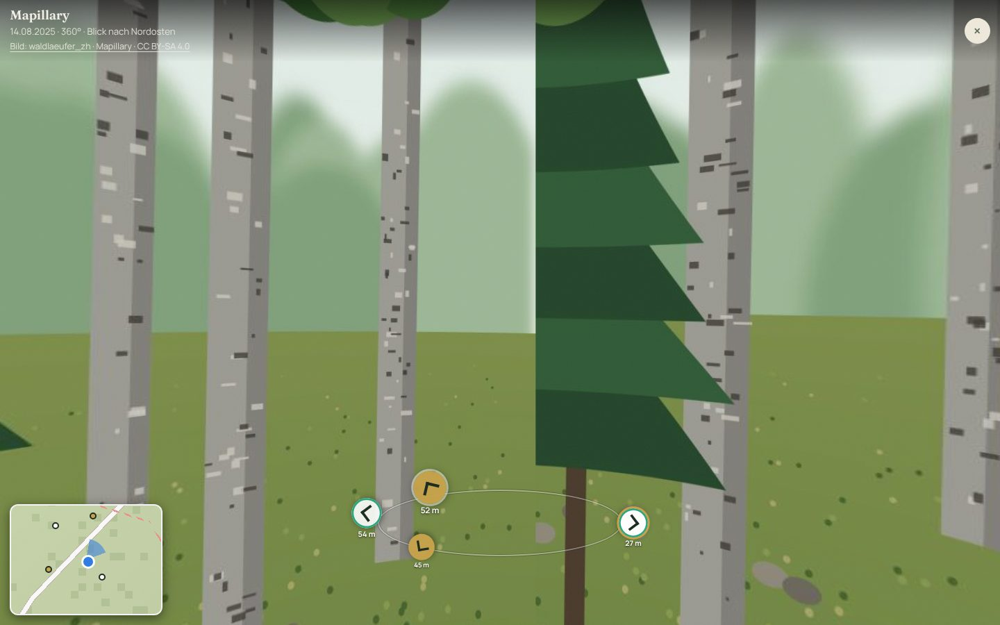
  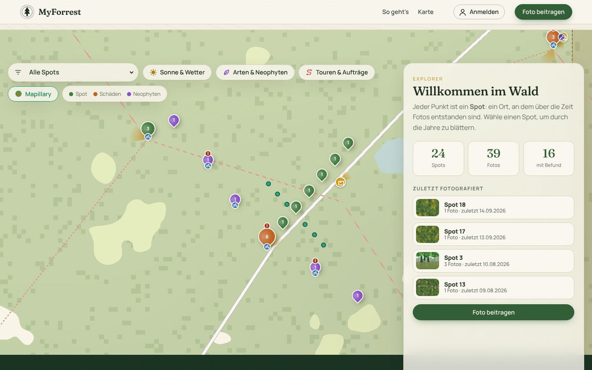
</p>

Wo es noch keine eigenen Bilder gibt, füllt **Mapillary** die Lücken (mit `MAPILLARY_TOKEN`): Blaugrüne Pfeile
führen zu Mapillary-Bildern in Richtungen ohne eigene Bilder (links), und man geht auf ihnen weiter, mit
Urheber und Lizenz oben (Mitte). Der Kartenknopf *Mapillary* zeigt die Bilder als Punkte, ein Klick startet
das Durchgehen dort (rechts). Nur der Server spricht mit Mapillary; die Bilder kommen von MyForrest und gehen
nach dem ersten Ansehen auch offline. (Die Mapillary-Bilder im Screenshot sind Demo-Panoramen.)

### 14. Gletscher und Gebirge

<p>
  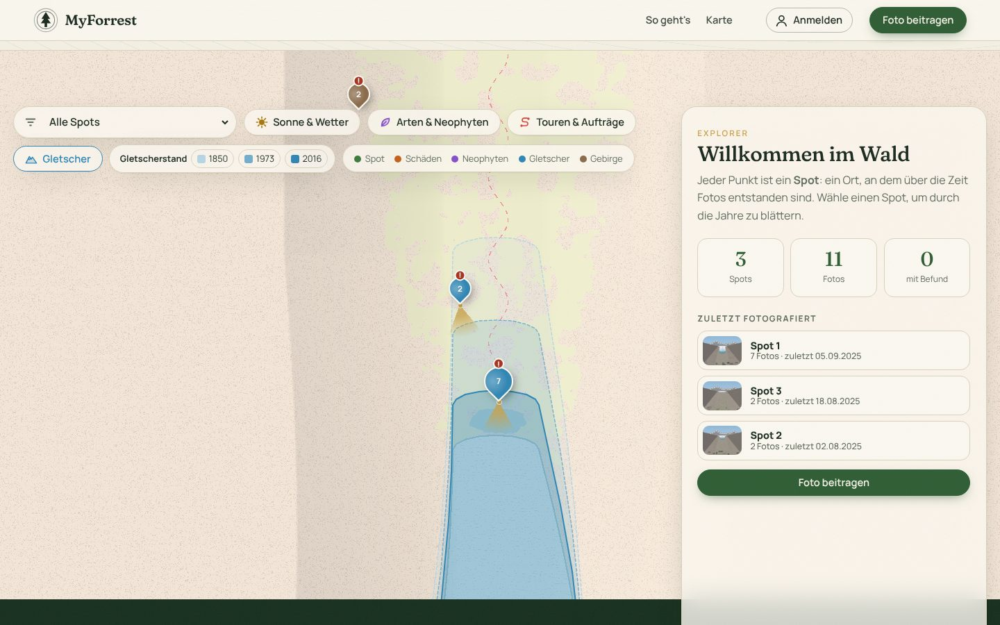
  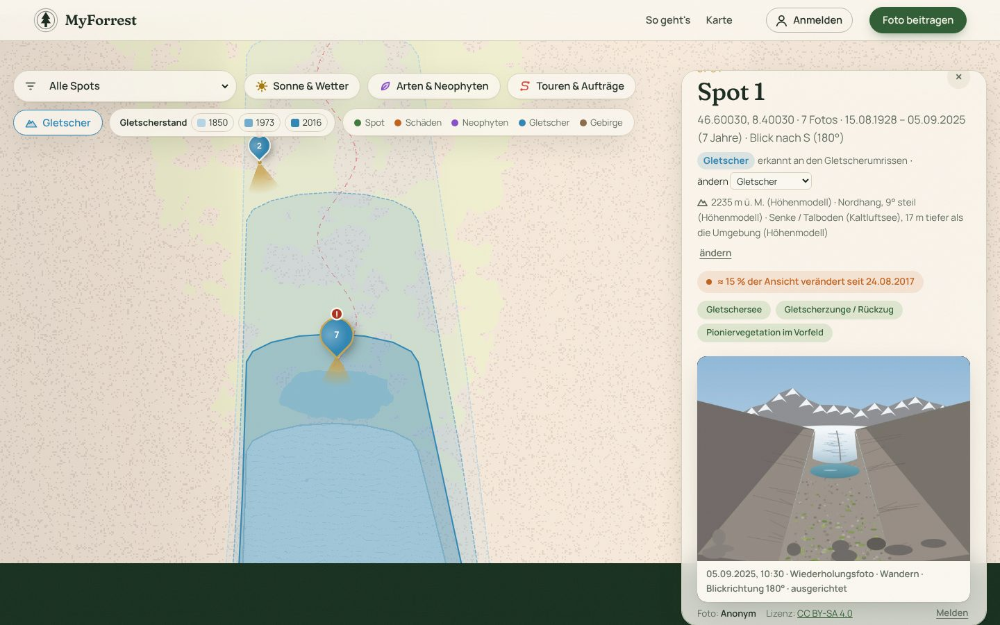
</p>

Jeder Spot hat ein **Landschaftsprofil**. Neben dem Wald gibt es den **Gletscher**: Liegt ein Spot auf dem
Eis eines Gletscherinventars, auf dem Eis eines früheren oder nahe am heutigen, erkennt die App ihn als
Gletscher-Spot (blauer Marker); sonst wählt man das Profil beim Hochladen oder im Spot. Gletscher-Spots bieten
eigene Beobachtungen an (Gletscherzunge, Gletschersee, Spalten, Schuttbedeckung, Toteis, Felssturz,
Murgang, Pioniervegetation), und die Waldbegriffe fallen weg: Veränderungen heissen nur «Veränderung», statt
Windwurf und Laubverfärbung. Der Knopf *Gletscher* zeichnet die Umrisse aller geladenen Inventare, hier
1850, 1973 und 2016, ältere heller; ein Klick auf ein Jahr zeigt nur dieses.

<p>
  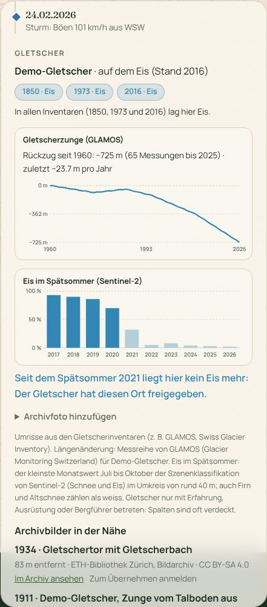
  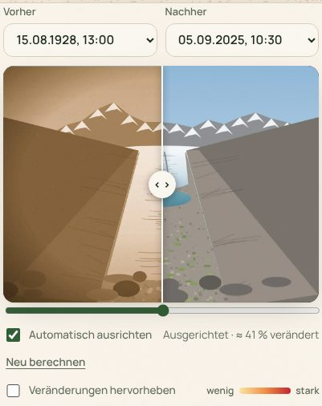
</p>

Der Gletscher-Teil eines Spots (links) nennt den Gletscher, den Abstand zum Eis des neusten Inventars und pro
Inventar, ob hier Eis lag. Darunter steht der **Anteil Schnee und Eis im Spätsommer** aus Sentinel-2, Jahr für
Jahr: Wenn der Winterschnee weg ist, bleibt nur noch Eis weiss. Fällt er dauerhaft unter die Hälfte, meldet die
App, seit wann der Gletscher den Ort freigegeben hat. **Archivfotos** wie alte Postkarten oder Dias bekommen
ihr Datum von Hand und werden auf die neuen Fotos ausgerichtet; im Vorher/Nachher (rechts) liegt die Postkarte
von 1928 neben 2025.

<p align="center">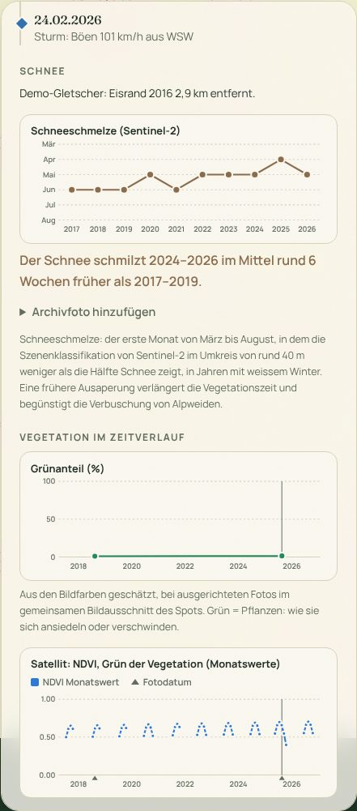</p>

Spots über 2100 m ohne Baumarten werden **Gebirge**-Spots (brauner Marker) mit Beobachtungen wie Felssturz,
Murgang, Lawine, Rutschung, Permafrost und Verbuschung der Alpweide. Ihr Teil *Schnee* zeigt pro Jahr, in
welchem Monat der Schnee schmilzt, und vergleicht die ersten mit den letzten Jahren, hier eine Alpweide, die
heute rund sechs Wochen früher aper ist und auf der Grünerlen einwachsen. Für **Trockengebiete** gibt es ein
eigenes Profil (Wanderdüne, Bodenerosion, Vegetationsverlust, Überweidung, Versalzung), gewählt beim Hochladen;
dort meldet der NDVI den Verlust an Vegetation.

## Was MyForrest kann

Ein kurzer Überblick. Alle Details, auch zu den verwendeten Verfahren, stehen unter
[Funktionen im Detail](docs/funktionen.md).

- **[Fotos erfassen](docs/funktionen.md#fotos-erfassen-und-verorten)**: Handyfotos (auch HEIC vom iPhone),
  Action-Cam-Serien mit GPX-Track und Videos von GoPro oder 360°-Kameras. Verortung über GPS, GPX oder von
  Hand. Als installierbare App funktioniert der Upload auch ohne Empfang im Wald und wird später gesendet.
- **[Spots und Zeitreise](docs/funktionen.md#spots-und-zeitreise)**: Fotos am selben Ort und mit derselben
  Blickrichtung werden automatisch zu Spots zusammengefasst und lassen sich als Zeitreihe durchblättern;
  360°-Aufnahmen und Bilderreihen lassen sich [wie Street View durchgehen](docs/funktionen.md#durchgehen-wie-street-view),
  wo eigene Bilder fehlen mit [Mapillary](docs/funktionen.md#mapillary).
- **[Bildanalyse](docs/funktionen.md#bildanalyse)**: automatische Ausrichtung, Veränderungs-Heatmap,
  Einordnung der Veränderungen (Windwurf, Auflichtung, Verfärbung, neuer Bewuchs), die aus Bestätigungen
  dazulernt, Objekterkennung für liegende Stämme und Holzpolter sowie Vegetationsdichte pro Foto.
- **[Wetter, Klima und Gelände](docs/funktionen.md#wetter-klima-und-gelände)**: Wetter-Kontext zu jedem
  Foto, Auffälligkeiten wie Trockenheit oder frühe Laubverfärbung, Stürme seit dem letzten Besuch,
  Höhe, Exposition, Kaltluftseen sowie Satellitendaten (NDVI und Feuchteindex NDMI aus Sentinel-2, vor 2017
  Landsat) als unabhängige Bestätigung und als Frühwarnung für Spots ohne neue Fotos, deren Schwellen sich an
  bestätigten Schäden eichen (getrennt für Laub- und Nadelwald) und an zurückgehaltenen Spots geprüft werden,
  als Push-Nachricht an alle, die den Spot regelmässig besuchen.
- **[Landschaften und Gletscher](docs/funktionen.md#landschaften-und-gletscher)**: Profile für Wald, Gletscher,
  Gebirge und Trockengebiet mit eigenen Beobachtungen; Gletscherumrisse aus Inventaren (z. B. GLAMOS) pro Jahr, Eis im Spätsommer
  und Schneeschmelze aus Sentinel-2, Archivfotos mit Datum von Hand.
- **[Kartenmodi](docs/funktionen.md#kartenmodi)**: Sonnenstand, Schatten und Einstrahlung inklusive
  Geländehorizont sowie Hotspots und Ausbreitungsfronten von Neophyten.
- **[Pflanzen und Baumarten](docs/funktionen.md#pflanzen-und-baumarten)**: Pflanzenbestimmung mit Pl@ntNet,
  Erkennung invasiver Neophyten, Artenbestand pro Spot und Export zu Info Flora, GBIF und iNaturalist.
- **[Offene Geodaten](docs/funktionen.md#offene-geodaten-für-gis-und-geoportale)**:
  - Alle Daten als OGC API – Features und GeoPackage, in WGS84 oder den Schweizer Landeskoordinaten LV95
    wie bei swisstopo.
  - Vektorkacheln (OGC API – Tiles, MVT) in Web Mercator und im Schweizer Kachelgitter LV95, vorberechnet
    und als PMTiles/MBTiles zum Herunterladen.
  - Zwei Vektorkarten: MapLibre in Web Mercator, OpenLayers auf der Landeskarte von swisstopo.
  - Metadaten für geocat.ch und opendata.swiss (GM03/ISO 19139).
  - Ein fertiges QGIS-Projekt für QGIS Server (WMS/WMTS/WFS) für Geoportale wie map.geo.admin.ch.
- **[Touren und Fotoaufträge](docs/funktionen.md#touren-und-fotoaufträge)**: Routen zeichnen, per GPS
  aufzeichnen oder importieren (GPX, FIT, TCX, KML, GeoJSON, NMEA), als GPX exportieren und speichern; Fotoaufträge
  ohne Zeit und Namen und Vorschläge entlang der eigenen Route.
- **[Geschützte Funde](docs/funktionen.md#geschützte-funde-und-pro-mitglieder)**: seltene Arten und Pilzstellen
  nur für verifizierte PRO-Mitglieder (Forstdienst, Naturschutz), öffentlich nur als 5-km-Raster;
  Organisationen nehmen ihre Mitglieder selbst auf.
- **[Fahrtmodus](docs/funktionen.md#fahrtmodus-dashcam-im-auto)**: das Handy als Dashcam im Auto, Route
  automatisch, Bilder an Spots und alle 150 m, Stillstand und Doppelte werden schon auf dem Gerät verworfen.
- **[Android-App](docs/android.md)**: die Web-App als App, Fahrtmodus und Tour-Aufzeichnung laufen im
  Hintergrund weiter (gesperrter Bildschirm, andere App vorne); Download unter
  [Releases](https://github.com/michifrey/myforrest/releases/latest/download/myforrest.apk).
- **[Konten und Moderation](docs/funktionen.md#konten-moderation-und-lizenzen)**: Konten mit Rollen, Anmeldung mit E-Mail (Bestätigungslink, Passwort ändern und zurücksetzen, Konto löschen, Profil mit den eigenen Fotos, Export der eigenen Daten) oder über Google, GitHub, Microsoft, SWITCH edu-ID, AGOV und weitere OpenID-Connect-Dienste,
  Lizenz pro Foto, Melden und Moderieren.

## Schnellstart

Voraussetzung: Node.js ≥ 22.5, für Videos zusätzlich `ffmpeg`.

```bash
npm install
npm start            # http://localhost:3000
npm test
```

Für das Kamera-Overlay auf dem Handy braucht es HTTPS. Wie das geht und welche Umgebungsvariablen es gibt,
steht unter [Installation und Konfiguration](docs/installation.md).

Mit QGIS Server für Geoportale gibt es zwei fertige Zusammenstellungen: Docker Compose unter
[`deploy/qgis-server`](deploy/qgis-server/README.md) und Kubernetes, etwa ein lokaler Cluster auf podman,
unter [`deploy/k8s`](deploy/k8s/README.md) (`deploy/k8s/start.sh`). Beide bringen einen eigenen Routing-Server
für den Wege-Magnet mit ([`deploy/brouter`](deploy/brouter/README.md)).

## Dokumentation

Die Doku gibt es auch als **Website** mit Suche, hellem und dunklem Design und *Seite bearbeiten*-Knopf:
**[michifrey.github.io/myforrest](https://michifrey.github.io/myforrest/)**, später unter docs.myforrest.xyz. Sie
entsteht aus `docs/*.md` (MkDocs Material) und wird bei jedem Merge neu veröffentlicht.

<p align="center">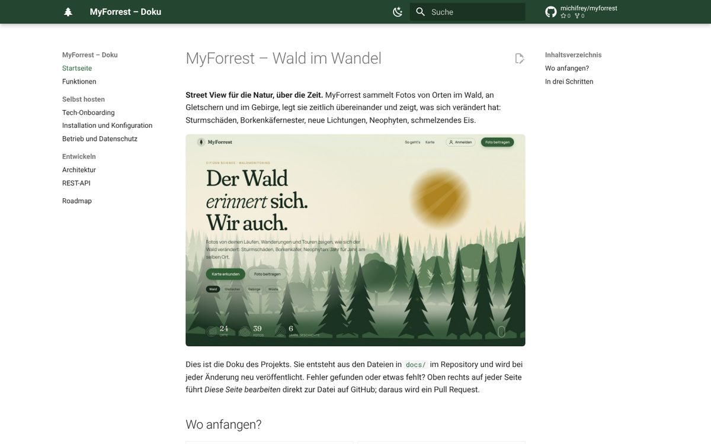</p>

| Dokument | Inhalt |
|----------|--------|
| [Funktionen im Detail](docs/funktionen.md) | Alle Funktionen mit Verfahren, Schwellenwerten und Grenzen |
| [Android-App](docs/android.md) | Fahrtmodus und Aufzeichnung im Hintergrund, Installieren, selbst bauen und signieren |
| [Tech-Onboarding](docs/tech-onboarding.md) | Selbst hosten: Voraussetzungen, Speicherplatz, Lizenzen, Ports, Zertifikate, ausgehende Verbindungen, Checkliste |
| [Installation und Konfiguration](docs/installation.md) | Voraussetzungen, HTTPS fürs Handy, Umgebungsvariablen, externer Detektor, Phänologie-Daten |
| [Betrieb, Datenschutz und Datenquellen](docs/betrieb.md) | Hinweise für einen öffentlichen Betrieb, externe Dienste und Quellenangaben |
| [Architektur](docs/architektur.md) | Aufbau des Codes, Module im Überblick |
| [REST-API](docs/api.md) | Alle Routen des Servers |
| [Roadmap](docs/roadmap.md) | Was als Nächstes geplant ist |
| [QGIS Server](deploy/qgis-server/README.md) und [Kubernetes](deploy/k8s/README.md) | Betrieb mit Geodiensten per Docker Compose oder Kubernetes |
| [Eigener Routing-Server](deploy/brouter/README.md) | BRouter für den Wege-Magnet, mit Routing-Daten für die Schweiz, Waldprofil, Wildruhezonen und fertigem Image |

## Daten und Lizenz

Kartendaten © OpenStreetMap-Mitwirkende, Landeskarte und Luftbild © swisstopo. Wetterdaten von
[Open-Meteo.com](https://open-meteo.com) (ERA5, CC BY 4.0). Enthält modifizierte Copernicus-Sentinel-Daten;
Landsat-Daten mit freundlicher Genehmigung des U.S. Geological Survey. Phänologie-Daten: Deutscher
Wetterdienst. Pflanzenbestimmung mit Pl@ntNet. Bilder von Mapillary (CC BY-SA 4.0) mit Urheber im Bild. Gletscherumrisse aus den geladenen Inventaren, z. B.
GLAMOS. Details unter [Datenquellen](docs/betrieb.md#externe-datenquellen-und-netzzugang).

Der Code steht unter der [Apache-Lizenz 2.0](LICENSE).
